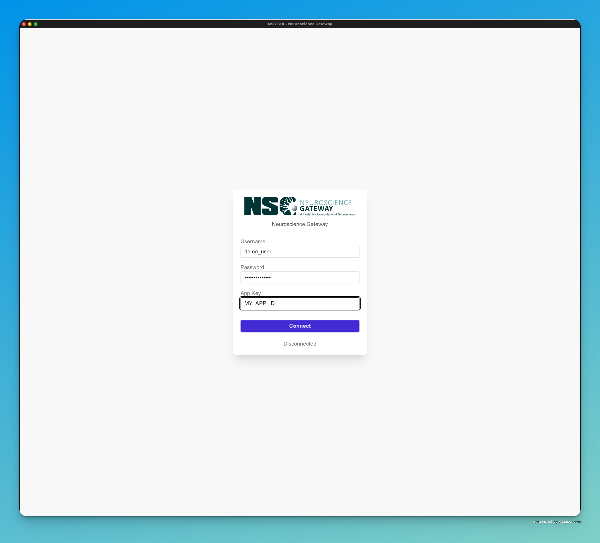
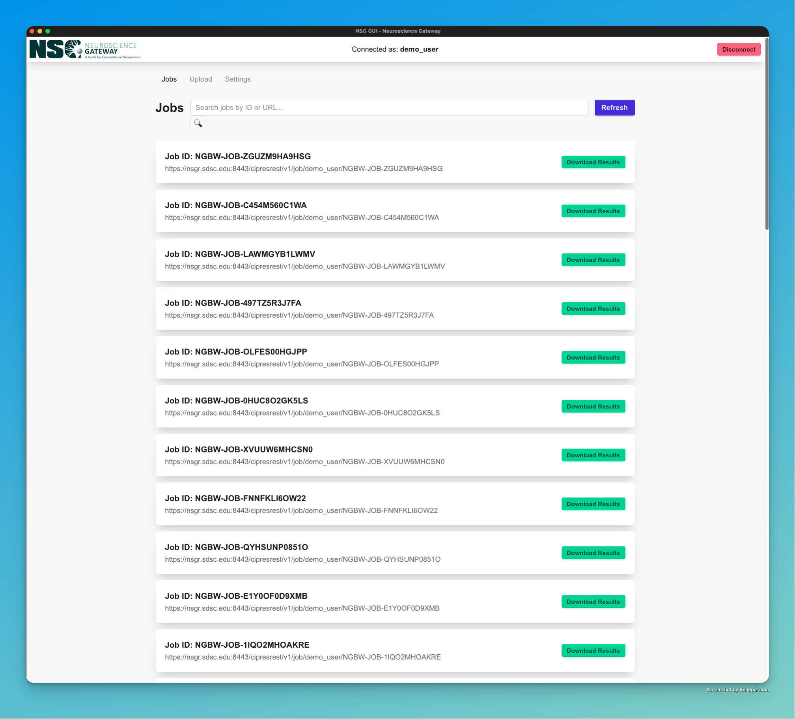
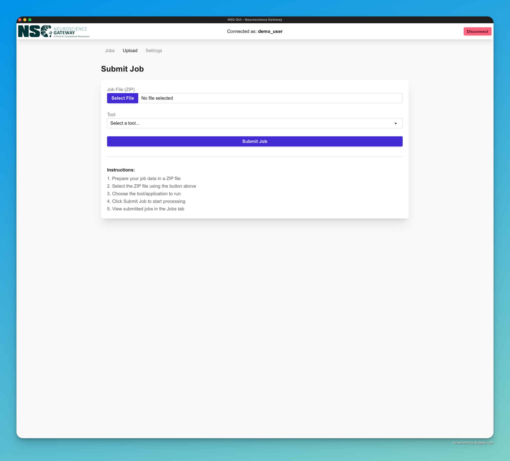
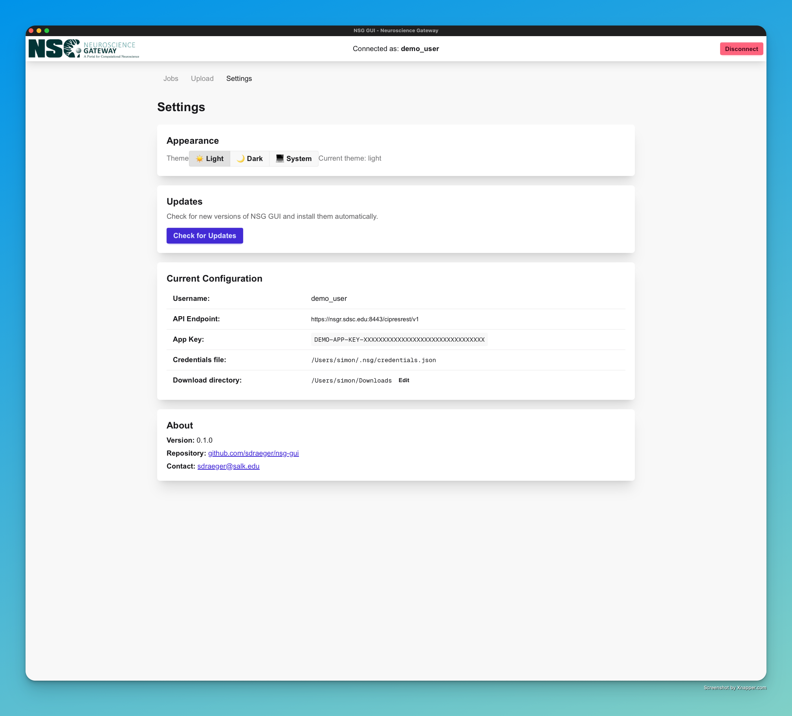

# NSG GUI - Neuroscience Gateway

A modern desktop application for the Neuroscience Gateway, built with **Tauri v2 + Next.js + React**.

## Screenshots

<div align="center">

### Login Screen
<a href="screenshots/screenshot1.png">
  
</a>
<p><i>Clean, centered login form with gradient background and auto-fill from stored credentials</i></p>

### Jobs Dashboard
<a href="screenshots/screenshot2.png">
  
</a>
<p><i>Card-based layout with job details, search functionality, and download buttons</i></p>

### Upload Form
<a href="screenshots/screenshot3.png">
  
</a>
<p><i>Native file picker with tool selector and status messages</i></p>

### Settings Panel
<a href="screenshots/screenshot4.png">
  
</a>
<p><i>Theme settings, update checker, and configuration options</i></p>

</div>

## Features

- **Modern UI** - Responsive interface built with Next.js, daisyUI and Tailwind CSS
- **Auto-login** - Automatically loads credentials from `~/.nsg/credentials.json`
- **Job Management** - View, submit, and manage NSG jobs with real-time search
- **File Upload** - Native file picker for job submission
- **Download Results** - Download job results as zip archives with one click
- **Auto-Updates** - Check for and install new versions directly from the app
- **Theme Support** - Light, dark, and system theme options
- **Customizable** - Adjust zoom level and download directory
- **Cross-platform** - Works on macOS, Linux, and Windows

## Architecture

- **Backend**: Rust + Tauri v2 + nsg-cli library
- **Frontend**: Next.js 16 (React 19) + TypeScript + Tailwind CSS
- **Build**: Static Site Generation (SSG) for Tauri compatibility

## Prerequisites (building from source)

1. **Rust** (latest stable)

   ```bash
   curl --proto '=https' --tlsv1.2 -sSf https://sh.rustup.rs | sh
   ```

2. **Node.js** (v18+) or **Deno** (v2+)

   ```bash
   # Option 1: Node.js
   # Download from https://nodejs.org/

   # Option 2: Deno
   curl -fsSL https://deno.land/install.sh | sh
   ```

3. **Tauri CLI**

   ```bash
   cargo install tauri-cli --version "^2.0.0"
   ```

4. **NSG Account**
   - Username, password, and app key from https://www.nsgportal.org/

## Setup

### 1. Install Dependencies

**Frontend (in `frontend/` directory):**

```bash
cd frontend
npm install  # or: deno install
```

**Backend (in `src-tauri/` directory):**

```bash
cd src-tauri
cargo build
```

### 2. Configure Credentials (Optional)

Create `~/.nsg/credentials.json`:

```json
{
  "username": "your-username",
  "password": "your-password",
  "app_key": "your-app-key"
}
```

Set permissions:

```bash
chmod 600 ~/.nsg/credentials.json
```

If you skip this, you can enter credentials in the login screen.

## Running the App

### Development Mode

```bash
# From the project root
cargo tauri dev
```

This will:

1. Start the Next.js dev server (port 3000)
2. Build the Rust backend
3. Launch the Tauri window

### Showcase Mode (Demo/Screenshots)

For demos, presentations, or screenshots, you can run the app with anonymized data:

```bash
# From the project root
./showcase.sh
```

Or manually:

```bash
SHOWCASE_MODE=1 cargo tauri dev
```

**What gets anonymized in the display:**

- Usernames → `demo_user` (only in UI display)
- Job IDs → `NGBW-JOB-XXXXXXXXXXXX` (consistent fake IDs)
- App keys → `DEMO-APP-KEY-XXXXXXXX...` (only in UI display)
- Job URLs → Anonymized while preserving structure
- A visible "SHOWCASE MODE" badge appears in the header

**Important:** Real credentials are still used for authentication - only the displayed data is anonymized. You can still connect and use the app normally with your actual NSG account.

This is perfect for:

- Taking screenshots for documentation
- Recording demos or tutorials
- Presenting at conferences
- Sharing UI previews without exposing sensitive data

### Production Build

```bash
# From the project root
cargo tauri build
```

The compiled app will be in `src-tauri/target/release/bundle/`.

**macOS**: `nsg-gui.app` or `nsg-gui.dmg`
**Linux**: `nsg-gui.AppImage` or `.deb`
**Windows**: `nsg-gui.exe` or `.msi`

## Usage

### Login Screen

- Enter your NSG username, password, and app key
- Or skip if you have `~/.nsg/credentials.json` configured (auto-login)

### Jobs Tab

- View all your NSG jobs
- Click "Refresh" to reload the list
- Click "Download Results" to download job outputs to `~/Downloads/nsg_results/`

### Upload Tab

- Click "Select File" to choose a ZIP file
- Select the tool (NEURON, Python, or R Script)
- Click "Submit Job" to upload and start processing
- View status messages and newly submitted jobs

### Settings Tab

- **Appearance**: Switch between Light, Dark, and System themes
- **Updates**: Check for new versions and install them automatically
- **Configuration**: View credentials location and customize download directory
- Edit download directory with browse button or manual path entry

## Project Structure

```
nsg-gui/
├── src-tauri/              # Rust backend (Tauri)
│   ├── Cargo.toml         # Rust dependencies
│   ├── tauri.conf.json    # Tauri configuration
│   ├── build.rs           # Build script
│   └── main.rs            # Tauri commands & NSG client
├── frontend/              # Next.js frontend
│   ├── app/              # Next.js app directory
│   │   ├── page.tsx      # Main React component
│   │   ├── layout.tsx    # Root layout
│   │   └── globals.css   # Global styles
│   ├── lib/              # Utilities
│   │   └── tauri.ts      # Tauri API wrappers
│   ├── package.json      # Node dependencies
│   └── next.config.mjs   # Next.js config (SSG mode)
└── README.md
```

## Tauri Commands (Backend API)

The Rust backend exposes these commands to the frontend:

| Command                                 | Description                       |
| --------------------------------------- | --------------------------------- |
| `load_credentials()`                    | Load stored credentials from disk |
| `connect(username, password, app_key)`  | Connect to NSG API                |
| `list_jobs()`                           | Get all user jobs                 |
| `get_job_status(job_url)`               | Get detailed job status           |
| `submit_job(file_path, tool)`           | Submit a new job                  |
| `download_results(job_url, output_dir)` | Download job results              |
| `get_download_dir()`                    | Get default download directory    |
| `get_credentials_location()`            | Get credentials file path         |

## Troubleshooting

### "Cannot find module '@tauri-apps/api'"

```bash
cd frontend
npm install @tauri-apps/api @tauri-apps/plugin-dialog
```

### "nsg-cli not found"

The nsg-cli library is included as a Rust dependency. No separate installation needed.

### "Failed to load credentials"

Make sure `~/.nsg/credentials.json` exists and has correct permissions (600).

### Build errors

```bash
# Clean build
cd src-tauri
cargo clean
cargo build

cd ../frontend
rm -rf .next node_modules
npm install
```

## Building for Distribution

### Automated Releases (Recommended)

The project includes a GitHub Actions workflow that automatically builds releases for all platforms.

**To create a release:**

1. Update version in `src-tauri/Cargo.toml` and `src-tauri/tauri.conf.json`
2. Commit your changes
3. Create and push a version tag:
   ```bash
   git tag v0.1.0
   git push origin v0.1.0
   ```
4. GitHub Actions will automatically:
   - Build for macOS (Apple Silicon + Intel)
   - Build for Windows (x64)
   - Build for Linux (x64)
   - Create a draft release with all installers

**Manual trigger:**
You can also trigger the release workflow manually from the GitHub Actions tab.

**Artifacts created:**

- **macOS**: `.dmg` installers for both architectures
- **Windows**: `.msi` and `.exe` installers
- **Linux**: `.deb`, `.AppImage`, and `.rpm` packages

### Manual Local Builds

#### macOS

```bash
cargo tauri build
# Creates: src-tauri/target/release/bundle/macos/nsg-gui.app
# And: src-tauri/target/release/bundle/dmg/nsg-gui_0.1.0_x64.dmg
```

#### Linux

```bash
cargo tauri build
# Creates: src-tauri/target/release/bundle/appimage/nsg-gui_0.1.0_amd64.AppImage
# And: src-tauri/target/release/bundle/deb/nsg-gui_0.1.0_amd64.deb
```

#### Windows

```bash
cargo tauri build
# Creates: src-tauri/target/release/bundle/msi/nsg-gui_0.1.0_x64_en-US.msi
```

## Auto-Updates

NSG GUI includes automatic update checking and installation.

**How it works:**

1. Go to **Settings** tab
2. Click **"Check for Updates"**
3. If an update is available, you'll see the version and release notes
4. Click **"Install Update"** to download and install
5. The app will restart automatically with the new version

**Under the hood:**

- Updates are fetched from GitHub Releases
- Only published releases trigger update notifications
- The updater uses Tauri's built-in security features
- Updates are downloaded, verified, and installed seamlessly

**For developers:**
When you create a new release using the GitHub Actions workflow, it automatically generates updater artifacts (`latest.json` and signature files) that enable the in-app update system.

## Security

- Credentials are stored in `~/.nsg/credentials.json` with 600 permissions
- No credentials are hardcoded or exposed in the frontend
- All API calls go through the Rust backend (Tauri commands)
- Tauri's security context prevents XSS and unauthorized access
- Updates are verified before installation

## Contributing

Contributions welcome! Please:

1. Fork the repository
2. Create a feature branch
3. Make your changes
4. Submit a pull request

## License

MIT License - see LICENSE file for details

## Acknowledgments

- [Neuroscience Gateway](https://www.nsgportal.org/) - NSG API
- [nsg-cli](https://crates.io/crates/nsg-cli) - Rust NSG client library
- [Tauri](https://tauri.app/) - Desktop app framework
- [Next.js](https://nextjs.org/) - React framework
- [Tailwind CSS](https://tailwindcss.com/) - UI styling

---

**Author**: Simon Draeger <sdraeger@salk.edu>
**Version**: 0.1.1
